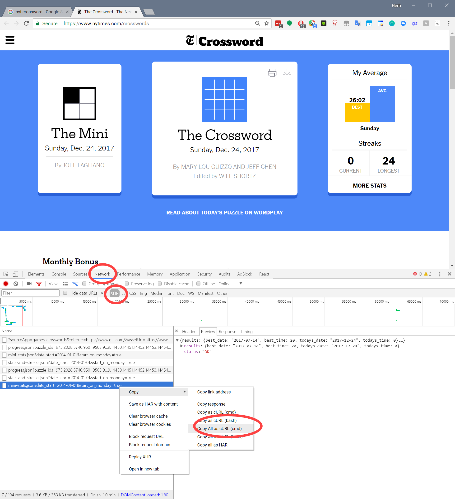
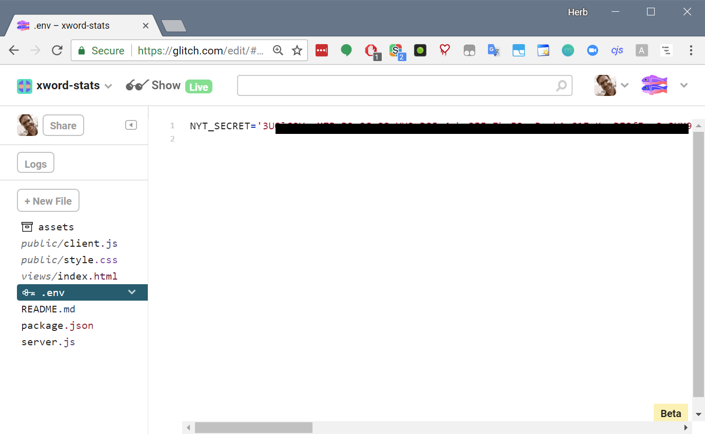
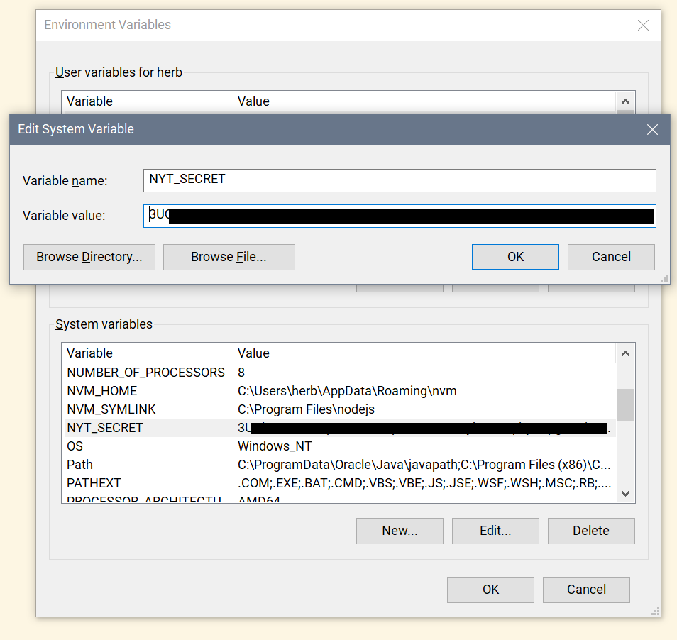

# xword-stats

### A data visualization of New York Times crossword puzzle solve times.

This is running on Glitch at https://xword-stats.glitch.me; you can remix it by visiting https://glitch.com/edit/#!/xword-stats. Source is on GitHub at https://github.com/HerbCaudill/xword-stats.

## Setting up

To use this to visualize your own solve times, you'll need to find your New York Times authentication secret. Here's one way:

Go to http://www.nytimes.com/crossword, sign in, and press <kbd>F12</kbd> to open Developer Tools. 
Click on the Network tab and reload the page. 
Filter to XHR. Right-click on any of the API results and choose 'Copy > Copy as cURL'.
 
</img>

Paste the result into a text editor; it should look something like this. 

    curl "https://nyt-games-prd.appspot.com/svc/crosswords/v3/53695385/mini-stats.json?date_start=2014-01-01^&start_on_monday=true" -H "origin: https://www.nytimes.com" -H "accept-encoding: gzip, deflate, br" -H "accept-language: en-US,en;q=0.9,es-419;q=0.8,es;q=0.7,fr;q=0.6,pt;q=0.5,ca;q=0.4,de;q=0.3" -H "user-agent: Mozilla/5.0 (Windows NT 10.0; Win64; x64) AppleWebKit/537.36 (KHTML, like Gecko) Chrome/63.0.3239.84 Safari/537.36" -H "accept: application/json, text/plain, */*" -H "referer: https://www.nytimes.com/crosswords" -H "nyt-s: XXXXXXXXXXXXXXXXXXXXXXXXXXXXXXX.XXXXXXXXXXXXXXXXXXXXXXXXXXXXXXXXXXXXX.XXXXXXXXXXXXXXXXXXXXXXXXXX/XXXXXXXXXXXXXXXXXXXXXXXXXX/XXXXX/XXXXXXXXXXXXXXXXXXXXXXXXX.XXXXXXXXXXXXXXX/XXXXXXXXXXXXXXXXXXX./XXXXXXXXXXXXXXXXXXXXXXXXX/XXXXXXX/XXXXXXXXXXXXXXXXXXXXXXX" -H "authority: nyt-games-prd.appspot.com" --compressed

Find the `nyt-s` parameter and copy the very long secret code. 
Add the environment variable and run. 

- **If using Glitch**, enter this value in `.env` as `NYT_SECRET`.

    </img>

- **If running locally in Windows**, this is under  `System Properties > Advanced > Environment Variables > System variables`. Click **New** and add a variable named `NYT_SECRET` with the copied code.

    </img>

    Update packages `npm install`, then start the site with `npm start`, then navigate to `http://localhost:9001`. 